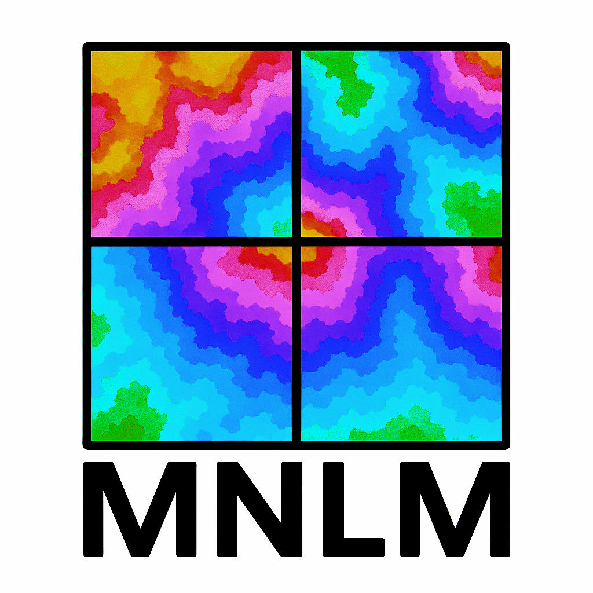
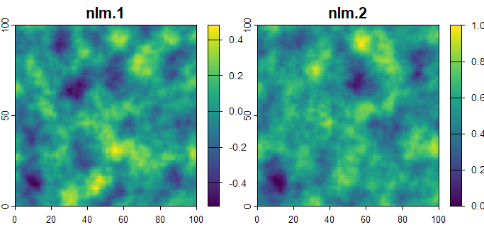
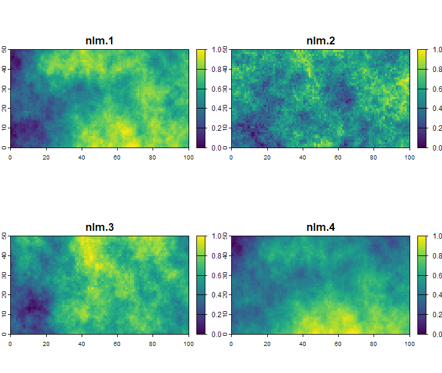

<table>
<tr>
<td style="vertical-align: middle;">
  <h1>MNLM</h1>
  <em>Generating Multiple Correlated Neutral Landscape Models</em>
</td>
<td style="text-align: right;">
  
</td>
</tr>
</table>

# Installation

The MNLM package can be downloaded and installed from Github.

First install the required dependencies, using the remotes package.

``` r
install.packages("remotes")
remotes::install_github("cran/RandomFieldsUtils")
remotes::install_github("cran/RandomFields")
remotes::install_github("ropensci/NLMR")
```

Then install MNLM from the Github repository.

``` r
remotes::install_github("ANON_URL/MNLM")
```

# Running MNLM

First load the MNLM package.

```{r}
library(MNLM)
```

Correlated NLM raster layers can be generated using any of the five NLM algorithms implemented in the MNLM package using just a single line of code. For example, we can use the Perlin noise algorithm implemented in the mnlm_perlin() function. Here, the 'frequency' and 'octaves' arguments specify the paramters for how the Perlin noise is generated. These can be tweaked to achieve different outcomes.

```{r, warning = FALSE}
perlin <- mnlm_perlin(nlayers = 2, r = 0.6, nrow = 100, ncol = 100,
                      frequency = 0.05, octaves = 4)
terra::plot(perlin)
```



We can even specify the parameters for individual layers within a set. For example, we can change both the octaves and frequency in the perlin noise algorithm to see how they change the structure of the resulting NLM layers by passing vectors to the 'frequency' and 'octaves' arguments in the mnlm_perlin() function.

```{r}
perlin <- mnlm_perlin(nlayers = 4, r = 0.5, nrow = 100, ncol = 100,
                      frequency = c(0.1, 0.3, 0.1, 0.3), octaves = c(2, 2, 6, 6))
terra::plot(perlin, main = c("freq = 0.1, octaves = 2", "freq = 0.3, octaves = 2", 
                             "freq = 0.1, octaves = 6", "freq = 0.3, octaves = 6"))
```


Other NLM algorithms can be customized just as easily. For example, to generate a set of three 50 x 100 rasters with correlations of r = 0.4, 0.6, and 0.8 using the fractal Brownian motion algorithm and fractal dimensions of 0.5, 1, 1.5, and 2, we can use the mnlm_fbm() function below.

```{r, warning = FALSE}
fbm <- mnlm_fbm(nlayers = 4, r = c(0.4, 0.6, 0.8), ncol = 100, nrow = 50, fract_dim = c(1, 0.5, 1, 2))
terra::plot(fbm)
```


